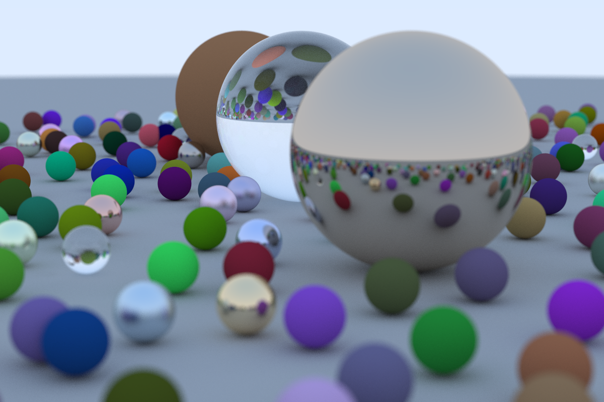

# Ray-Tracing

一个光线追踪渲染器，内容主要来自[Ray Tracing in One Weekend—The Book Series](https://raytracing.github.io/)
原项目是我用 CPU 运行的[光线追踪](https://github.com/clumsy-sy/Ray-Tracing)，打算尝试用 CUDA 完成。

## 编译运行

本项目需要 `cuda` 环境 `nvcc` 编译器。

**编译**
1. nvcc 一行编译
```sh
make build
make ALL # 编译运行
```
2. cmake 编译

```sh
make cmALL
```

**运行**
```sh
just run [图片名]
```

**性能分析**

```sh
make perf
```

编译运行并且记录运行时间（有些场景需要运行很久）
```sh
time ./build/RayTracing
```


## 待优化

- [ ] 内存管理有较大问题
- [ ] 场景初始化调用的是 <<<1,1>>> 应当改为多线程 

## 待完成

- [ ] SAH 算法的实现，现在的 BVH 并不够智能与高效，需要更加优秀的划分策略。
- [ ] 重要性采样

## 图片展示

